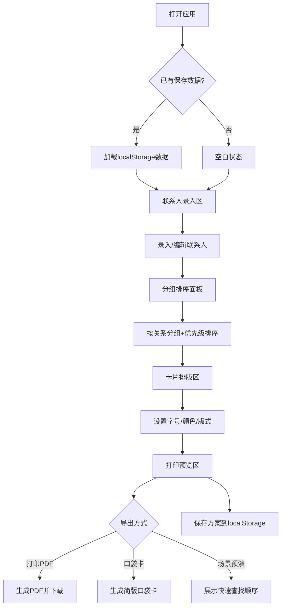

## 1. 产品概述

面向家庭老年人及照护者的「家庭电话本重排与大字应急联系卡生成器」，解决手写电话本涂改模糊、紧急时找不到号码的问题。用户录入各类联系人后，系统自动按关系分组、标注紧急优先级，并生成大字清晰的应急联系卡，支持打印、导出PDF和口袋卡。

- 目标用户：独居老人、居家照护家庭、社区网格员
- 核心价值：让紧急联系信息一目了然，3秒内找到关键号码

## 2. 核心功能

### 2.1 用户角色

| 角色 | 说明 |
|------|------|
| 主要用户 | 老年人或照护者，录入和管理联系人 |
| 辅助用户 | 家属，协助整理和打印联系卡 |

### 2.2 功能模块

1. **主页面**：联系人录入区、分组排序面板、卡片排版区、打印预览区，四区联动一站式操作

### 2.3 页面详情

| 页面 | 模块 | 功能描述 |
|------|------|----------|
| 主页面 | 联系人录入区 | 添加/编辑/删除联系人，包含姓名、电话、关系分组、紧急优先级、备注；支持批量导入 |
| 主页面 | 分组排序面板 | 按关系分组（亲属/邻居/社区网格员/医院/维修/药店），组内拖拽排序，紧急联系人置顶标记 |
| 主页面 | 卡片排版区 | 字号调节（大/中/超大）、颜色强调设置、选择版式（电话机旁/冰箱门/随身口袋卡），实时预览 |
| 主页面 | 打印预览区 | 全屏预览、PDF导出、口袋卡生成、场景快速查找预演 |

## 3. 核心流程

用户打开应用 → 录入联系人信息（姓名、电话、分组、优先级） → 系统按分组和优先级自动排序 → 用户调整字号/颜色/版式 → 预览并导出（打印PDF/口袋卡） → 保存方案到localStorage

## 4. 用户界面设计

### 4.1 设计风格

- 主色调：暖橙色（#E8652B）传达温馨与紧急感，辅以米白色（#FFF8F0）底色
- 次要色：深灰棕（#3D2C2C）用于文字，浅灰绿（#7BAE7F）用于非紧急分组标签
- 按钮风格：大圆角（12px），紧急操作用实色填充，辅助操作用描边样式
- 字体：使用 Noto Serif SC 作为标题字体（传统文化感），Noto Sans SC 作为正文字体（清晰易读）
- 布局：左侧录入面板 + 右侧实时预览卡片，顶部工具栏
- 图标：使用 lucide-vue-next 图标库，配合文字标注

### 4.2 页面设计概览

| 页面 | 模块 | UI要素 |
|------|------|--------|
| 主页面 | 联系人录入区 | 卡片式表单，分组下拉选择，紧急星级标记，大号添加按钮 |
| 主页面 | 分组排序面板 | 分组标签栏，拖拽排序列表，紧急置顶徽章 |
| 主页面 | 卡片排版区 | 版式切换标签（电话机旁/冰箱/口袋卡），字号滑块，颜色选择器，实时预览 |
| 主页面 | 打印预览区 | 全屏预览按钮，PDF导出按钮，口袋卡按钮，场景预演下拉 |

### 4.3 响应式

- 桌面优先设计，大屏四区并排展示
- 平板端录入与预览上下排列
- 移动端简化为标签页切换

### 4.4 无障碍

- 所有交互元素支持键盘操作
- 字号可调节至超大号
- 颜色对比度符合 WCAG AA 标准
