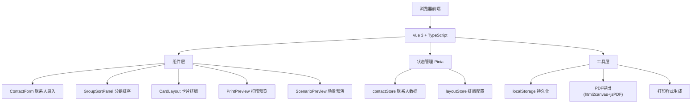
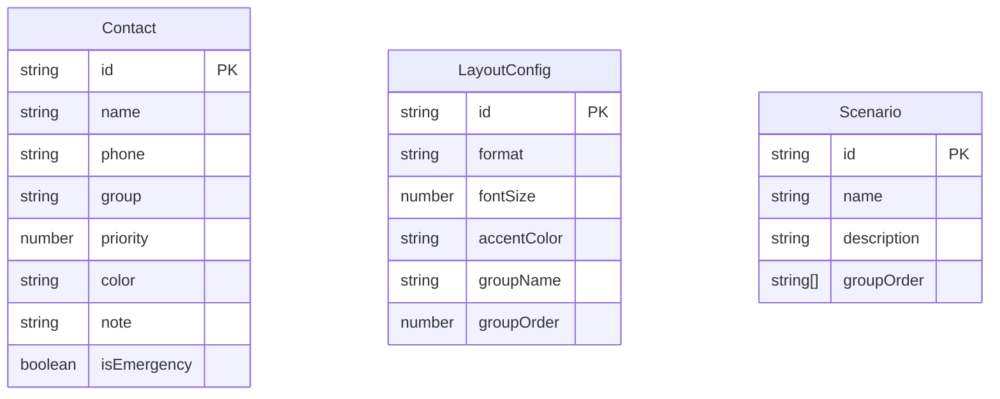

## 1. 架构设计



## 2. 技术说明

- 前端：Vue 3 + TypeScript + Vite + Tailwind CSS
- 初始化工具：vite-init (vue-ts 模板)
- 状态管理：Pinia
- 后端：无（纯前端应用）
- 数据库：无（使用 localStorage 持久化）
- PDF导出：html2canvas + jsPDF
- 图标：lucide-vue-next

## 3. 路由定义

| 路由 | 用途 |
|------|------|
| / | 主页面，包含联系人录入、分组排序、卡片排版、打印预览四区 |

## 4. 数据模型

### 4.1 数据模型定义



### 4.2 数据定义

```typescript
interface Contact {
  id: string
  name: string
  phone: string
  group: ContactGroup
  priority: number
  color: string
  note: string
  isEmergency: boolean
}

type ContactGroup = 'family' | 'neighbor' | 'community' | 'hospital' | 'repair' | 'pharmacy'

interface LayoutConfig {
  format: 'phone-side' | 'fridge' | 'pocket'
  fontSize: 'large' | 'medium' | 'extra-large'
  accentColor: string
  groupOrder: ContactGroup[]
}

interface Scenario {
  id: string
  name: string
  description: string
  groupOrder: ContactGroup[]
}
```

## 5. 关键组件

| 组件 | 职责 |
|------|------|
| ContactForm | 联系人增删改查表单，分组选择、紧急标记 |
| ContactList | 联系人列表展示，支持分组筛选 |
| GroupSortPanel | 分组标签切换、组内拖拽排序、紧急置顶 |
| CardLayout | 版式切换、字号调节、颜色配置、实时预览 |
| PrintPreview | 全屏预览、PDF导出、口袋卡生成 |
| ScenarioPreview | 场景选择（急救/报修/购药等）、快速查找顺序展示 |
